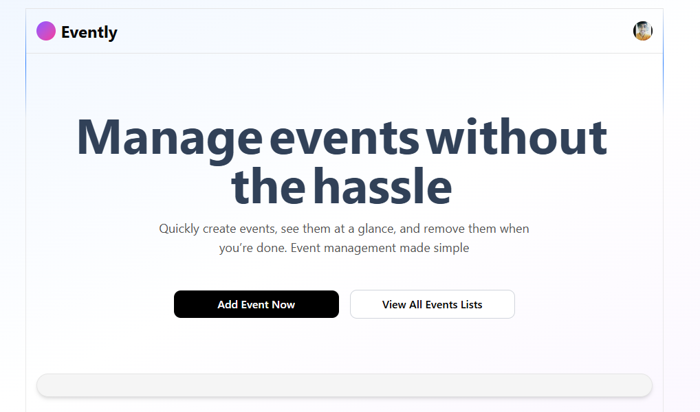
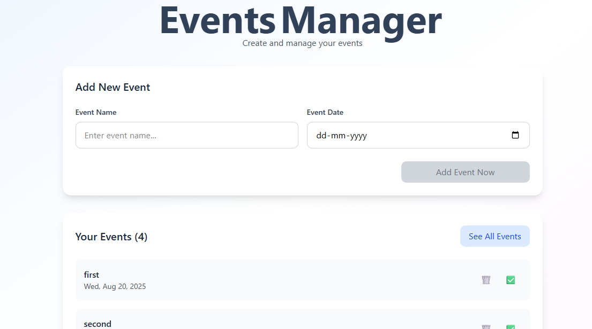
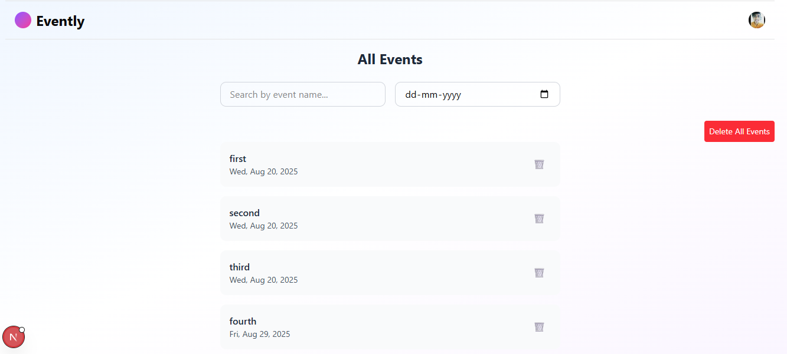

# 📅 Evently

Evently is a simple **event management app** built with **Next.js 14, TypeScript, TailwindCSS, Clerk (auth), Zustand (state management), and Supabase (database)**.  
You can **add events, view all events, mark them as done, and delete them**.  

---

## ⚡ Features
- 🔑 Authentication with [Clerk](https://clerk.com)  
- ➕ Add events with name & date  
- 📋 View all events in a clean list  
- ✅ Mark events as completed  
- ❌ Delete single event or clear all events  
- 🗄️ Events stored persistently in **Supabase**  
- 🎨 Modern UI with **TailwindCSS&AccernityUI**  

---

## 📸 Screenshots

### 🏠 Landing Page


### ➕ Add Event Page


### 📋 Events List Page


*(Add your actual screenshots inside a `/screenshots` folder in your repo so they render properly.)*

---

## 🛠️ Tech Stack
- [Next.js 14](https://nextjs.org/) (App Router, SSR)  
- [TypeScript](https://www.typescriptlang.org/)  
- [TailwindCSS](https://tailwindcss.com/)  
- [Clerk](https://clerk.com/) (authentication)  
- [Zustand](https://zustand-demo.pmnd.rs/) (state management)  
- [Accernity UI]() (animation)  

---

## 🚀 Getting Started

### 1️⃣ Clone the repository and run
```bash
git clone https://github.com/your-username/evently.git
cd evently
pnpm dev